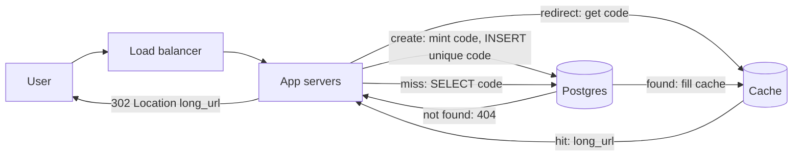
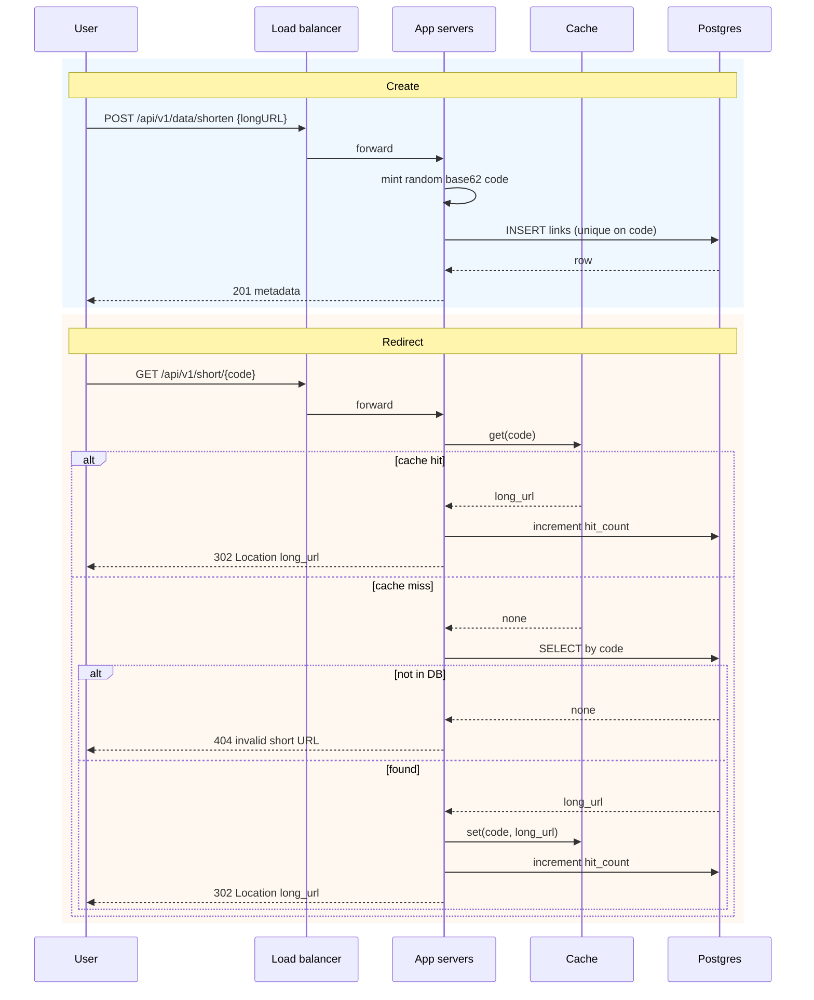

# Architecture

## Package map

- `do_blitz/app.py` — FastAPI factory: health, shorten, metadata, redirect
- `do_blitz/config.py` — `PORT`, `LOG_LEVEL`, `DATABASE_URL`, `REDIS_URL`, `PUBLIC_BASE_URL`, `RATE_LIMIT_SHORTEN_PER_MIN`
- `do_blitz/models.py` — Pydantic v2 request and metadata payloads (`longURL` / `shortURL`)
- `do_blitz/codes.py` — base62 alphabet and short-then-longer generators
- `do_blitz/service.py` — create / lookup / resolve (`hit_count` increment)
- `do_blitz/store.py` — `LinkStore` protocol, `MemoryLinkStore`, `PostgresLinkStore`
- `do_blitz/cache.py` — `RedirectCache` protocol, `MemoryRedirectCache`, `RedisRedirectCache`
- `do_blitz/rate_limit.py` — `RateLimiter` protocol, `MemoryRateLimiter`, `RedisRateLimiter`

There are no PUT, PATCH, or DELETE routes. Codes are immutable after insert. Custom aliases are out of this lock.

## Diagram

Create and redirect share one load balancer and a pool of app servers. The cache sits only on the redirect path.

### Redirect path

1. The user requests the short URL (`GET /api/v1/short/{code}`).
2. The load balancer forwards the request to a web or app server.
3. If the short code is in the cache, the app returns 302 to the long URL.
4. On a cache miss, the app fetches the row from Postgres.
5. If the code is not in the database, the short URL is invalid and the app returns 404.
6. If the row is found, the app writes `code → long_url` into the cache and returns 302 to the long URL.

A successful redirect also increments `hit_count` in Postgres. Metadata `GET /api/v1/data/{code}` does not use the cache.

### Create path

The app mints a random base62 `code`, inserts the row into Postgres (unique on `code`), and returns 201. Create does not write the cache. The first redirect fills it.

### IDs and uniqueness

The running service uses a random base62 `code` as the primary key. There is no separate numeric id and no hash of the long URL.

At much higher write QPS, a distributed unique ID generator (Snowflake-style or range counters) encoded as base62 for the public code avoids random-collision retries. That switch is not cheap enough to make now. Keep random base62 plus the unique constraint.

## API

| Method | Path | Result |
| --- | --- | --- |
| POST | `/api/v1/data/shorten` | 201 metadata. Body `{"longURL": "<string>"}`. 429 after `RATE_LIMIT_SHORTEN_PER_MIN` requests in a 60-second window from the same client IP. |
| GET | `/api/v1/data/{shortCode}` | 200 metadata JSON. No redirect. Unknown code is 404. |
| GET | `/api/v1/short/{shortCode}` | **302 Found**. `Location` is the original long URL. Increments `hit_count` (JSON field `hits`). |
| GET | `/health` | 200 `{"status":"ok"}`. |

Metadata fields (API JSON): `code`, `shortURL`, `longURL`, `created_at`, `hits`.

## Data model (`links`)

| Column | Type | Notes |
| --- | --- | --- |
| `code` | text / varchar, unique PK | base62 public key |
| `long_url` | text | original URL |
| `created_at` | timestamptz | insert time |
| `hit_count` | bigint, default 0 | incremented on redirect |

Rows are immutable aside from `hit_count`. No update/delete routes and no soft-delete column.
Each create may mint a **new** code for the same `long_url` (no “same URL → same code” idempotency unless locked later).
API JSON still names the counter `hits` (maps from `hit_count`).

`shortURL` is `{PUBLIC_BASE_URL or request base}/api/v1/short/{code}`.

Validation at the HTTP boundary (Pydantic, OpenAPI at `/docs`):

- `longURL` must be `http` or `https`, max 2048 characters
- bad body → 422
- invalid short URL (unknown code) → 404
- too many `POST /api/v1/data/shorten` from one client IP → 429 `{"detail":"rate limit exceeded: too many shorten requests from this client"}` with `Retry-After: 60`

Auto codes use `[0-9a-zA-Z]` only. Generation starts at length 6 and grows on collision up to 12.

## Storage

`LinkStore` is the persistence interface. Production uses `PostgresLinkStore` when `DATABASE_URL` is set (SQLAlchemy 2.x + psycopg). `code` is the primary key (unique).

Without `DATABASE_URL` the process uses `MemoryLinkStore` so health and local API tests can run offline. CI sets `DATABASE_URL` and runs against Postgres.

`RedirectCache` maps `code` to `long_url` (or none). Production uses `RedisRedirectCache` when `REDIS_URL` is set. Otherwise the process uses `MemoryRedirectCache` (per instance, good enough for tests). This repo does not provision DigitalOcean Managed Redis.

`RateLimiter` counts `POST /api/v1/data/shorten` per client IP in a 60-second fixed window. Production uses `RedisRateLimiter` when `REDIS_URL` is set so every app instance shares the same counters. Otherwise the process uses `MemoryRateLimiter` (per instance). The client IP is the first `X-Forwarded-For` hop when that header is present, else `request.client.host`. `RATE_LIMIT_SHORTEN_PER_MIN` defaults to 60. `0` disables the limit. Redirect is not rate-limited.

## Scale (BOTE, not encoded in code)

Lucas planning numbers. The process does not preallocate 365B rows or hundreds of TB.

- 100M creates/day ≈ 100e6 / 86400 ≈ **1160 writes/s**
- Reads:writes ≈ 10:1 ⇒ about **12k redirects/s** at that create rate
- 10 years at 100M/day ≈ **365B records**
- ~100 byte average URL plus row overhead and indexes → **tens to hundreds of TB**

Implications:

- Managed Postgres for the durable unique `code` index
- App Platform multi-instance; uniqueness is the database constraint, not an in-process lock
- `GET /api/v1/short/{shortCode}` is the hot read path (cache, then DB lookup, plus `hit_count` increment)
- A 6-character base62 space is 62^6 ≈ 56.8B codes. Collision then lengthens. 7 characters is 62^7 ≈ 3.5T

## Web server scaling

The app servers hold no session state. App Platform puts a load balancer in front of them. You add or remove containers to change capacity. Sticky sessions are not used. Durable state lives in Postgres (`DATABASE_URL`). The optional redirect cache and the rate limiter live in Redis when `REDIS_URL` is set.

App Platform high availability needs at least two containers so the load balancer has a failover target. See [App Platform limits](https://docs.digitalocean.com/products/app-platform/details/limits/). Autoscaling is available on eligible plans. CPU-based autoscaling needs dedicated CPUs. Request-based autoscaling works on shared or dedicated CPUs. See [How to scale apps](https://docs.digitalocean.com/products/app-platform/how-to/scale-app/).

## Database scaling

Create and redirect uniqueness stay on one Postgres primary. A managed standby replicates that primary for failover and optional read traffic. See [How to add standby nodes](https://docs.digitalocean.com/products/databases/postgresql/how-to/add-standby-nodes/). Vertical growth and replicas come first. Sharding a unique `code` primary key across many writers is a last step, used when one primary cannot hold the write rate or the 365B-row store from the scale notes above.

Postgres is the store because the unique constraint on `code` is the concurrency control, creates need a transaction, and DigitalOcean Managed Databases can run that engine with a standby. The [Managed Databases SLA](https://www.digitalocean.com/sla/databases) is 99.95% monthly uptime for a cluster with standby nodes and 99.5% without.

## Analytics

`hit_count` (API field `hits`) is a redirect counter. The row does not record when a click happened. Time-series click analytics need an event log or warehouse, which this service does not write. A `last_accessed_at` column on redirect would be a cheap last-click stamp later. It is not in the schema now.

## HA, uniqueness, idempotency

Target deploy (not provisioned here): App Platform, multiple app instances, Managed Postgres. Redis is optional (`REDIS_URL`) and is not provisioned here.

Concurrency control is the unique constraint on `code`. Two instances that roll the same random code: one insert wins, the other retries with a new code.

Create is not naturally idempotent. A client that retries after a lost 201 can insert a second code for the same long URL. On unknown outcome, GET `/api/v1/data/{shortCode}` if the client already saw a code; otherwise treat a retry as a new link.

`hit_count` increment is a single `UPDATE … SET hit_count = hit_count + 1` per redirect.

## Availability, consistency, and reliability

### Availability

The [App Platform SLA](https://www.digitalocean.com/sla/app-platform) commits to 99.95% monthly uptime per App Component Instance (ACI). The [Managed Databases SLA](https://www.digitalocean.com/sla/databases) commits to 99.95% monthly uptime for a cluster with standby nodes and 99.5% without. App Platform HA needs at least two containers so the load balancer can fail over. See [App Platform limits](https://docs.digitalocean.com/products/app-platform/details/limits/).

### Consistency

Create is strongly consistent. The unique primary key on `code` is the source of truth. Codes are immutable, so `long_url` does not change after insert. The first redirect after create can miss the cache and read Postgres. That is a brief cold cache, not a stale `long_url`. `hit_count` is best-effort under concurrency. Each successful redirect runs one `UPDATE … SET hit_count = hit_count + 1`. The count can drift if that write fails after the 302, or if the 302 never runs the increment.

### Reliability

Managed Postgres with a standby fails over automatically. See [PostgreSQL features](https://docs.digitalocean.com/products/databases/postgresql/details/features/). Daily backups and seven-day point-in-time recovery cover accidental loss. See [How to restore from backups](https://docs.digitalocean.com/products/databases/postgresql/how-to/restore-from-backups/). `PostgresLinkStore` uses SQLAlchemy `pool_pre_ping=True` so a new connection replaces one that died during a brief failover blip.

## Out of scope

DigitalOcean tokens, App Platform / Managed Postgres / Managed Redis provisioning, update/delete, auth, custom aliases.

## Decision trades

- Codes: random base62 mint + DB unique constraint (not hash of URL) → no hash-collision rings; rare insert races retry/lengthen 6→12.
- IDs stay random base62 (no Snowflake or range-counter generator) → enough uniqueness at current write QPS; a distributed ID encoded as base62 is the scale alternative when collision retries become the bottleneck.
- Redirect: 302 not 301 → safer for hit counting / cache; can flip to 301 later.
- Immutable links: no update/delete → simpler model; no correction path.
- Store: Postgres when `DATABASE_URL` set, memory otherwise → local/CI velocity vs durable prod.
- Redirect path under `/api/v1/short/{code}` → matches locked API; full `shortURL` longer than root `/{code}`.
- Scale BOTE in docs only → design target; not pre-provisioned capacity.
- Cache: Redis when `REDIS_URL` is set, process-local memory otherwise → no DigitalOcean Managed Redis; CI and tests stay offline.
- Rate limit: in-process fixed window by default, Redis when `REDIS_URL` is set → instances share one counter; 429 after `RATE_LIMIT_SHORTEN_PER_MIN` (default 60) per client IP on `POST /api/v1/data/shorten`. Redirect stays unlimited so a viral link or a shared NAT is not blocked.
- App tier: stateless App Platform containers behind the platform load balancer, no sticky sessions → scale by adding or removing instances. HA needs at least two containers for load-balancer failover. Autoscaling is plan-dependent.
- Database: one Postgres primary plus a standby before any shard → unique `code` and transactions stay on one writer. Shard only when that primary cannot hold writes or the 365B-row store.
- Analytics: `hits` is a click count, not a click time → keep the counter. An event log or warehouse is the path for when-they-clicked.
