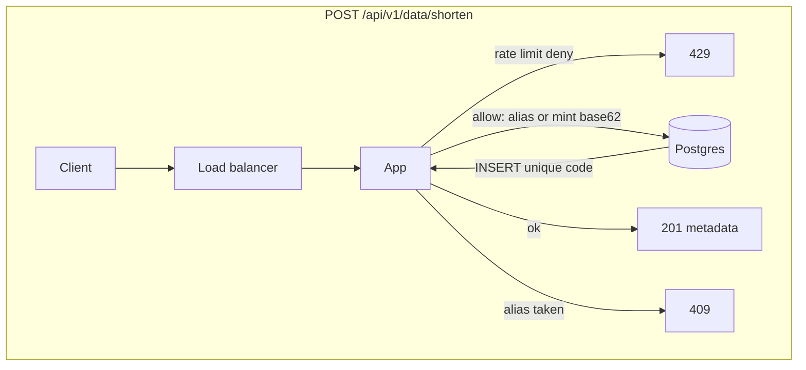
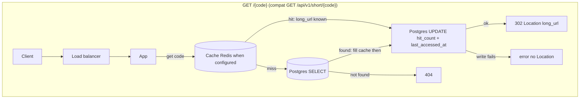
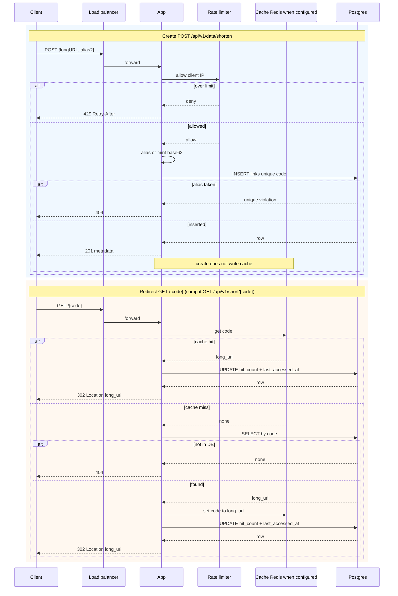
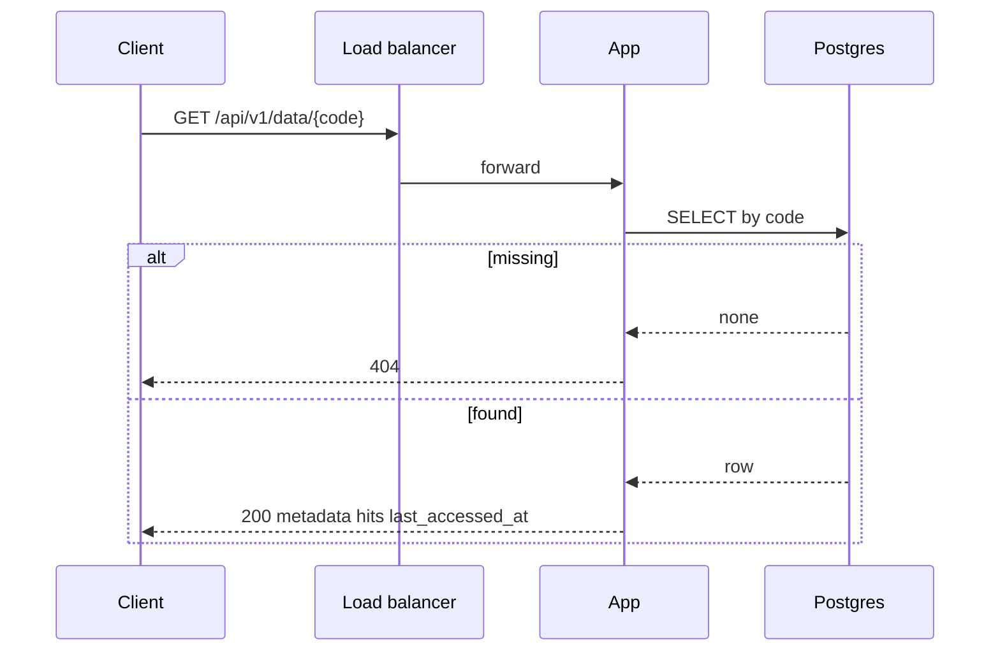

# Architecture

## Contents

- [Package map](#package-map)
  - [Runtime](#runtime)
  - [Tests (by topic)](#tests-by-topic)
  - [Ship](#ship)
- [Diagram](#diagram)
  - [High level — Create](#high-level--create)
  - [High level — Redirect](#high-level--redirect)
  - [Sequence — Create and Redirect](#sequence--create-and-redirect)
  - [Sequence — Metadata (no cache, no hit bump)](#sequence--metadata-no-cache-no-hit-bump)
  - [Path notes](#path-notes)
- [Problem scope](#problem-scope)
- [High level design](#high-level-design)
- [Deep dive](#deep-dive)
  - [API](#api)
  - [Data model (`links`)](#data-model-links)
  - [Storage, cache, and rate limit](#storage-cache-and-rate-limit)
  - [Scale (BOTE, not encoded in code)](#scale-bote-not-encoded-in-code)
  - [Web server scaling](#web-server-scaling)
  - [Database scaling](#database-scaling)
  - [Analytics](#analytics)
  - [HA, uniqueness, idempotency](#ha-uniqueness-idempotency)
  - [Availability, consistency, and reliability](#availability-consistency-and-reliability)
  - [Decision trades](#decision-trades)
- [Wrap up](#wrap-up)

## Package map

### Runtime

| Concern | File | Look here for |
| --- | --- | --- |
| HTTP routes, status codes, XFF, wiring | `do_blitz/app.py` | `create_app`, `/health`, `/`, shorten, metadata, `/{code}` + `/api/v1/short/{code}` redirect, `_short_url` |
| Request/response shapes + URL/alias validation | `do_blitz/models.py` | `ShortenIn`, `LinkOut`, `_http_https_url`, `_optional_alias` |
| Env/settings | `do_blitz/config.py` | `Settings`, `load_settings`, `sqlalchemy_url` |
| Create / get / resolve (hits + last_accessed) | `do_blitz/service.py` | `create_link`, `get_link`, `resolve_link` |
| Persistence | `do_blitz/store.py` | `Link`, `LinkStore`, `MemoryLinkStore`, `PostgresLinkStore`, `build_store` |
| Redirect cache | `do_blitz/cache.py` | `RedirectCache`, Redis vs memory, `build_cache` |
| Shorten rate limit | `do_blitz/rate_limit.py` | `RateLimiter`, Redis vs memory, `build_limiter` |
| base62 codes + reserved names | `do_blitz/codes.py` | `generate_code`, `iter_candidate_codes`, `is_reserved_code` |
| Demo UI | `static/index.html` | form → POST shorten |

### Tests (by topic)

| Topic | File |
| --- | --- |
| health | `tests/test_health.py` |
| links / alias / redirect / validation | `tests/test_links.py` |
| codes / DB URL normalize | `tests/test_codes.py` |
| cache | `tests/test_cache.py` |
| rate limit | `tests/test_rate_limit.py` |
| fail-fast store | `tests/test_config_store.py` |
| wipe safety | `tests/test_db_wipe_safety.py` |
| UI `/` | `tests/test_ui.py` |
| fixtures (incl. wipe guards) | `tests/conftest.py` |

### Ship

| Artifact | Role |
| --- | --- |
| `Dockerfile` | App Platform image; `CMD` honors `${PORT:-8000}` |
| `requirements.txt` | runtime deps |
| `.github/workflows/ci.yml` | pytest + Postgres service |

No PUT, PATCH, or DELETE routes. Codes are immutable after insert (optional `alias` on create only).

## Diagram

Create and redirect share one load balancer and app instances. Durable rows live in Postgres. Cache (Redis when `REDIS_URL` is set, otherwise process-local memory) sits on the **redirect** path only. Create never writes the cache.

### High level — Create

Create does **not** touch Cache.

### High level — Redirect

### Sequence — Create and Redirect

### Sequence — Metadata (no cache, no hit bump)

Metadata reads Postgres only. It does not use Cache and does not increment `hit_count` / `last_accessed_at`.

### Path notes

**Create:** rate limit → alias or mint base62 → `INSERT` unique `code` → `201` (or `409` if alias taken, `429` if over limit). No cache write.

**Redirect:** cache get → on hit **or** after a DB hit: `UPDATE hit_count` + `last_accessed_at` → `302 Location`. DB miss → `404`. Cache fill only on the DB-hit path. If the hit write fails, the handler errors (no `Location`).

**IDs:** random base62 `code` is the primary key (optional alias uses the same column). No separate numeric id and no hash of the long URL. At much higher write QPS, a distributed unique ID encoded as base62 is the scale alternative; keep random base62 plus the unique constraint for now.

## Problem scope

What we built: mint a short code (random base62 or optional alias), redirect with **302** to the long URL, and read metadata (`hits`, `last_accessed_at`). Links are immutable after create — no update or delete.

Constraints in force: Postgres via `DATABASE_URL` for durable storage; optional Redis/Valkey via `REDIS_URL` for redirect cache and create rate limit; public redirect under `/{code}` with compat `GET /api/v1/short/{code}`.

Out of scope here: DigitalOcean tokens and provisioning (App Platform / Managed Postgres / Managed Redis), auth, update/delete of links, click-history analytics beyond `hits` + `last_accessed_at`, and custom domain.

## High level design

Clients hit a load balancer in front of stateless app instances. Postgres holds durable `links` rows. Cache (Redis when configured, else process-local) is on the **redirect** path only — create never writes it. Rate limit applies to create (`POST /api/v1/data/shorten`), not redirect.

Flow pictures and path notes sit under [Diagram](#diagram) above. File ownership is under [Package map](#package-map). Details and scale notes are under [Deep dive](#deep-dive).

## Deep dive

### API

| Method | Path | Result |
| --- | --- | --- |
| POST | `/api/v1/data/shorten` | 201 metadata. Body `{"longURL": "<string>", "alias": "<optional>"}`. 409 if `alias` is already a code. 429 after `RATE_LIMIT_SHORTEN_PER_MIN` requests in a 60-second window from the same client IP. |
| GET | `/api/v1/data/{shortCode}` | 200 metadata JSON. No redirect. Unknown code is 404. |
| GET | `/{code}` | **302 Found**. `Location` is the original long URL. Increments `hit_count` (JSON field `hits`) and sets `last_accessed_at`. Reserved first-path tokens are not treated as codes. |
| GET | `/api/v1/short/{shortCode}` | Same **302** as `/{code}` (compat). |
| GET | `/health` | 200 `{"status":"ok"}`. |
| GET | `/` | Demo UI (static). |

Metadata fields (API JSON): `code`, `shortURL`, `longURL`, `created_at`, `hits`, `last_accessed_at`. `last_accessed_at` answers "when was this link last clicked?". `hits` still answers how many times.

### Data model (`links`)

| Column | Type | Notes |
| --- | --- | --- |
| `code` | text / varchar, unique PK | base62 public key. This is the only public identifier stored. |
| `long_url` | text | original URL |
| `created_at` | timestamptz | insert time |
| `hit_count` | bigint, default 0 | incremented on redirect |
| `last_accessed_at` | timestamptz, null | set on each successful redirect |

There is **no** `shortURL` column. Postgres stores `code` only. `_short_url` in `do_blitz/app.py` composes the API field at response time as `{PUBLIC_BASE_URL or request base}/{code}`. Changing the public domain or path does not rewrite rows.

Rows are immutable aside from `hit_count` and `last_accessed_at`. No update/delete routes and no soft-delete column.
Each create may mint a **new** code for the same `long_url` (no “same URL → same code” idempotency unless locked later).
API JSON still names the counter `hits` (maps from `hit_count`).

Validation at the HTTP boundary (Pydantic). Humans should use **ReDoc at `/redoc`** (primary); Swagger UI at `/docs` is secondary for try-it-out:

- `longURL` must be `http` or `https`, max 2048 characters
- `alias` is optional. When present it must be base62 `[0-9a-zA-Z]`, length 3-32, and must not be a reserved name (`api`, `health`, `docs`, `redoc`, `static`, `short`, `data`, `v1`, case-insensitive). `GET /{code}` also rejects those names plus `openapi.json` so it cannot steal `/health`, `/docs`, `/redoc`, `/openapi.json`, `/api`, or `/static`.
- taken `alias` → 409
- bad body or bad alias → 422
- invalid short URL (unknown code) → 404
- too many `POST /api/v1/data/shorten` from one client IP → 429 `{"detail":"rate limit exceeded: too many shorten requests from this client"}` with `Retry-After: 60`

Auto codes use `[0-9a-zA-Z]` only. Generation starts at length 6 and grows on collision up to 12.

### Storage, cache, and rate limit

`LinkStore` is the persistence interface. The running service requires `DATABASE_URL` and uses `PostgresLinkStore` (SQLAlchemy 2.x + psycopg). `code` is the primary key (unique). `build_store` fails fast without `DATABASE_URL` unless `allow_memory=True` (pytest fixtures only). CI sets `DATABASE_URL` and exercises Postgres.

`RedirectCache` maps `code` to `long_url` (or none). Production uses `RedisRedirectCache` when `REDIS_URL` is set. Otherwise the process uses `MemoryRedirectCache` (per instance, good enough for tests). This repo does not provision DigitalOcean Managed Redis.

`RateLimiter` counts `POST /api/v1/data/shorten` per client IP in a 60-second fixed window. Production uses `RedisRateLimiter` when `REDIS_URL` is set so every app instance shares the same counters. Otherwise the process uses `MemoryRateLimiter` (per instance). The client IP is the first `X-Forwarded-For` hop when that header is present, else `request.client.host`. That hop is spoofable unless the App Platform / load balancer sanitizes `X-Forwarded-For` (trusted proxy). `RATE_LIMIT_SHORTEN_PER_MIN` defaults to 60. `0` disables the limit. Redirect is not rate-limited.

### Scale (BOTE, not encoded in code)

Lucas planning numbers. The process does not preallocate 365B rows or hundreds of TB.

- 100M creates/day ≈ 100e6 / 86400 ≈ **1160 writes/s**
- Reads:writes ≈ 10:1 ⇒ about **12k redirects/s** at that create rate
- 10 years at 100M/day ≈ **365B records**
- ~100 byte average URL plus row overhead and indexes → **tens to hundreds of TB**

Implications:

- Managed Postgres for the durable unique `code` index
- App Platform multi-instance; uniqueness is the database constraint, not an in-process lock
- `GET /{code}` (and compat `GET /api/v1/short/{shortCode}`) is the hot read path (cache, then DB lookup, plus `hit_count` increment)
- A 6-character base62 space is 62^6 ≈ 56.8B codes. Collision then lengthens. 7 characters is 62^7 ≈ 3.5T

### Web server scaling

The app servers hold no session state. App Platform puts a load balancer in front of them. You add or remove containers to change capacity. Sticky sessions are not used. Durable state lives in Postgres (`DATABASE_URL`). The optional redirect cache and the rate limiter live in Redis/Valkey when `REDIS_URL` is set.

App Platform high availability needs at least two containers so the load balancer has a failover target. See [App Platform limits](https://docs.digitalocean.com/products/app-platform/details/limits/). Autoscaling is available on eligible plans. CPU-based autoscaling needs dedicated CPUs. Request-based autoscaling works on shared or dedicated CPUs. See [How to scale apps](https://docs.digitalocean.com/products/app-platform/how-to/scale-app/).

#### App Platform size vs HA (this session)

DigitalOcean App Platform `basic-xxs` / `basic-xs` allow **max `instance_count=1`**. HA with `instance_count≥2` requires a larger slug (in practice `professional-xs` was the smallest size that accepted two instances).

**Prod HA path:** move the app component to a size that allows ≥2 instances so the platform LB can fail over (matches DO App Platform HA guidance).

**This deploy:** stay **1× `basic-xxs`** for cost after briefly trying 2× `professional-xs`. Accept a single-instance app tier. Managed Postgres keeps multi-node standby for data-plane durability; Valkey remains the shared cache and rate-limit plane.

**Why:** app-tier HA costs more than this account needed for the dress rehearsal; durability for stored links already sits on Managed Postgres standby.

### Database scaling

Create and redirect uniqueness stay on one Postgres primary. A managed standby replicates that primary for failover and optional read traffic. See [How to add standby nodes](https://docs.digitalocean.com/products/databases/postgresql/how-to/add-standby-nodes/). Vertical growth and replicas come first. Sharding a unique `code` primary key across many writers is a last step, used when one primary cannot hold the write rate or the 365B-row store from the scale notes above.

Postgres is the store because the unique constraint on `code` is the concurrency control, creates need a transaction, and DigitalOcean Managed Databases can run that engine with a standby. The [Managed Databases SLA](https://www.digitalocean.com/sla/databases) is 99.95% monthly uptime for a cluster with standby nodes and 99.5% without.

### Analytics

`hit_count` (API field `hits`) is how many times the short URL was clicked. `last_accessed_at` is when it was last clicked (null until the first redirect). Time-series click analytics still need an event log or warehouse, which this service does not write.

### HA, uniqueness, idempotency

Target deploy: App Platform, multiple app instances, Managed Postgres. Redis/Valkey is optional (`REDIS_URL`). This repo does not create DigitalOcean resources; App Platform + Postgres + Valkey are provisioned outside this repo when deploying.

Concurrency control is the unique constraint on `code`. Two instances that roll the same random code: one insert wins, the other retries with a new code.

Create is not naturally idempotent. A client that retries after a lost 201 can insert a second code for the same long URL. On unknown outcome, GET `/api/v1/data/{shortCode}` if the client already saw a code; otherwise treat a retry as a new link.

`hit_count` increment is a single `UPDATE … SET hit_count = hit_count + 1, last_accessed_at = <now>` per redirect.

### Availability, consistency, and reliability

#### Availability

The [App Platform SLA](https://www.digitalocean.com/sla/app-platform) commits to 99.95% monthly uptime per App Component Instance (ACI). The [Managed Databases SLA](https://www.digitalocean.com/sla/databases) commits to 99.95% monthly uptime for a cluster with standby nodes and 99.5% without. App Platform HA needs at least two containers so the load balancer can fail over. See [App Platform limits](https://docs.digitalocean.com/products/app-platform/details/limits/).

#### Consistency

Create is strongly consistent. The unique primary key on `code` is the source of truth. Codes are immutable, so `long_url` does not change after insert. The first redirect after create can miss the cache and read Postgres. That is a brief cold cache, not a stale `long_url`. Redirect increments `hit_count` / `last_accessed_at` **before** returning the 302; if that write fails, the handler errors (no `Location` / no silent 302). Concurrent redirects can still interleave on the counter itself (atomic SQL `hit_count = hit_count + 1`).

#### Reliability

Managed Postgres with a standby fails over automatically. See [PostgreSQL features](https://docs.digitalocean.com/products/databases/postgresql/details/features/). Daily backups and seven-day point-in-time recovery cover accidental loss. See [How to restore from backups](https://docs.digitalocean.com/products/databases/postgresql/how-to/restore-from-backups/). `PostgresLinkStore` uses SQLAlchemy `pool_pre_ping=True` so a new connection replaces one that died during a brief failover blip.

### Decision trades

- Codes: random base62 mint + DB unique constraint (not hash of URL) → no hash-collision rings; rare insert races retry/lengthen 6→12.
- IDs stay random base62 (no Snowflake or range-counter generator) → enough uniqueness at current write QPS; a distributed ID encoded as base62 is the scale alternative when collision retries become the bottleneck.
- Redirect: 302 not 301 → safer for hit counting / cache; can flip to 301 later.
- Immutable links: no update/delete → simpler model; no correction path.
- Store: `DATABASE_URL` required at runtime (Postgres); `MemoryLinkStore` only via `allow_memory=True` in tests → no silent in-memory prod.
- Public short URL is `/{code}`; `GET /api/v1/short/{code}` stays for compat. `shortURL` is composed at runtime from public base + `code`, not stored. Reserved first-path tokens stay out of the code space so `/{code}` cannot steal health, docs, or API mounts.
- Scale BOTE in docs only → design target; not pre-provisioned capacity.
- Cache: Redis when `REDIS_URL` is set, process-local memory otherwise → no DigitalOcean Managed Redis; CI and tests stay offline.
- Rate limit: in-process fixed window by default, Redis when `REDIS_URL` is set → instances share one counter; 429 after `RATE_LIMIT_SHORTEN_PER_MIN` (default 60) per client IP on `POST /api/v1/data/shorten`. Redirect stays unlimited so a viral link or a shared NAT is not blocked.
- App tier: stateless App Platform containers behind the platform LB, no sticky sessions → scale by adding or removing instances. DO `basic-xxs`/`basic-xs` max `instance_count=1`; app HA (≥2) needs a larger slug (e.g. `professional-xs`). This session: **1× basic-xxs** for cost; prod HA would scale size then instances. Autoscaling is plan-dependent.
- Database: one Postgres primary plus a standby before any shard → unique `code` and transactions stay on one writer. Shard only when that primary cannot hold writes or the 365B-row store.
- Analytics: `hits` is how many clicks, `last_accessed_at` is the last click time → last-click only. An event log or warehouse is the path for a click history.
- Custom alias: optional `alias` on create, unique `code` constraint → 409 on conflict. Reserved path tokens stay out of the code space.

## Wrap up

**Demo:** live UI, ReDoc, Swagger, health, and curl 302 happy path — [Demo Kit in README](./README.md#demo-kit).

**Accepted ops choices for this deploy:** 1× App Platform `basic-xxs` (app-tier HA needs a larger size for ≥2 instances); `/health` checks the process plus a Postgres ping; no custom domain.

**Where to go next:** custom domain; raise app size then `instance_count` for platform LB failover.
